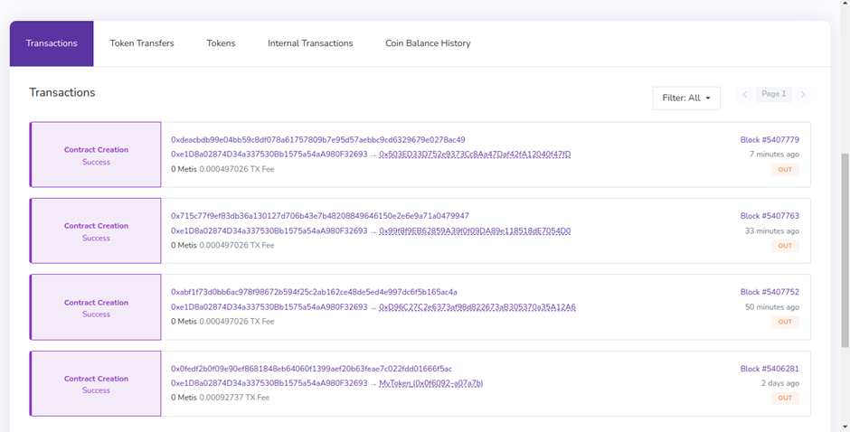

# MPC module

<figure><figcaption></figcaption></figure>

Multi Party Computation (MPC) module is a part of Sequencer node and is responsible for the management of the entire life-cycle of the multisignature keys. Conducts external operations such as:

1. Multisig generation
2. Key resharing
3. Applying the signature
4. Deletion of signature
5. Provides support for the asynchronous usage of many multisignatures

## Core method processing flow

`keyGen` process flow

Phase 1: Notifying MPC Nodes to Prepare

* Generate a random `sessionID` locally;
* Broadcast the `keyGenPrepare` message to all MPC nodes using the p2p network;
* Upon receiving the `keyGenPrepare` message, each MPC node starts its processing goroutine;
* Check the local data (the data means whether the TSS module has stored the mpc information corresponding to the id) based on the `keyId`;
* If there is existing data in the `READY` state, return the data from storage directly. No need to proceed with the `keyGen` operation;
* If there is existing data with a `PENDING` state, return an error to avoid inconsistencies in key generation due to concurrent execution of different key generation calls;
* Establish a p2p communication channel;
* Return the `keyGenReady` message to the initiating node;

Phase 2: Initiating the `keyGen` process

* The initiating node waits to receive `keyGenReady` messages from all nodes;
* Once the initiating node receives `keyGenReady` messages from all nodes, it broadcasts the `keyGenStart` message to all MPC nodes using the p2p network;
* Upon receiving the `keyGenStart` message, each MPC node:
  * Constructs a `LocalParty` instance locally;
  * Begins receiving information from other nodes;

#### Additional processes flow

* In essence, the processing flow of `keySign` is similar to `keyGen`, with the difference lying in some data transmission and verification..
* On the other hand, `keyDelete` does not involve any TSS-lib operations. It only requires broadcasting the `KeyDeleteMessage` message to all nodes to request the deletion of the key.

#### TSS Library:

Threshold Signature Scheme Library - open-source multisig tool library and the main source of MPC logic:

* Responsible for the multisig key algorithm layer

#### Key Local Storage:

* Conducts the saving and encrypting the key’s info in the local kv storage (levelDB) provided by the corresponding node
* The specific fields are described as follows:
  * `keyId`: The unique identifier of the multi-signature key pair. Passed in by the consensus layer caller, it is guaranteed that only one key pair can be generated for the same keyID;
  * `keySsessionId`: The session id when the key is generated (keyGen), randomly generated. The module will ensure that the value is different every time it is called;
  * `data`: Key storage data, generated by tss-lib. It mainly includes: public key (address), private key fragmentation, and all partyIds participating in multi-signature. The specific data is in tss-libkeygen.LocalPartySaveData;
  * `status`: The status of the current key data, mainly consists of three types:
    * `PENDING` (processing)
    * `READY` (already available)
    * `ERROR` (An error occurred during generation, the current key cannot be used to sign)

#### Tendermint channel:

Open-source p2p communication and consensus library provided by cosmos-sdk:

* POS Node creates a separate Tendermint channel for communication messages between multiple p2p nodes during MPC operations

#### libp2p

ibp2p Is an open-source p2p network communication library

* MPC uses libp2p `inCommunication` messages between multiple different p2p nodes, supporting information transmission during MPC operation
